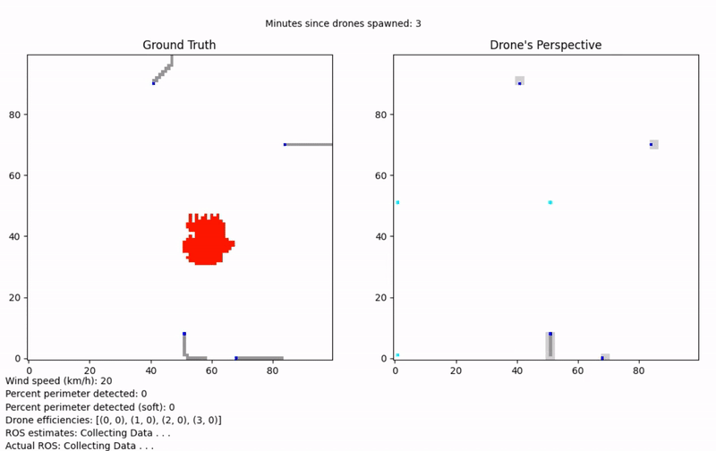

# Fire-Mapping-Drones
Authors: Mark Miller and Rohit Bernard
Description: simulates the use of a drone-swarm for locating and then mapping the perimeter of a wildfire in real time. Users can change simulation parameters including wind speed, initial fire size and number of drones.  See demo-paper for more details on the simulation environment. 

